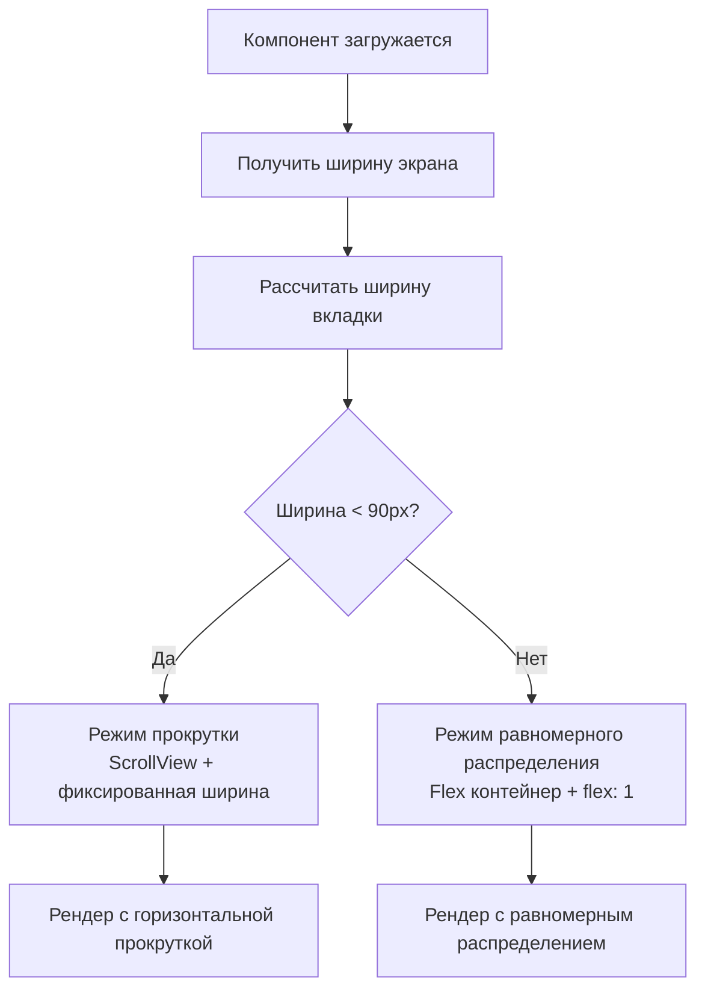

# Адаптивные вкладки счетов - Равномерное распределение

## 🎯 Проблема

На странице счетов вкладки (Карты и счета, Долги, Кредиты, Цели) имели неадаптивную верстку:

- ❌ **На больших экранах**: Много пустого места справа, вкладки прижаты к левому краю
- ❌ **На маленьких экранах**: Вкладки свайпаются влево-вправо, но неравномерно
- ❌ **Фиксированные отступы**: `paddingHorizontal: 16` не адаптировались к размеру экрана

## ✅ Решение

### **1. Адаптивная логика отображения**

Создана система, которая автоматически выбирает лучший способ отображения в зависимости от размера экрана:

```typescript
// Рассчитываем ширину каждой вкладки
const tabWidth = screenWidth / tabs.length;

// Минимальная ширина для комфортного чтения - 90px
const needsScroll = tabWidth < 90;
```

### **2. Два режима отображения**

**Маленькие экраны (< 360px ширина на вкладку):**
- ✅ **ScrollView** с горизонтальной прокруткой
- ✅ **Фиксированные отступы** для читаемости
- ✅ **Плавная прокрутка** между вкладками

**Большие экраны (≥ 360px ширина на вкладку):**
- ✅ **Равномерное распределение** по всей ширине
- ✅ **Flex: 1** для каждой вкладки
- ✅ **Полное использование** доступного пространства

### **3. Динамические стили**

```typescript
const styles = StyleSheet.create({
  tab: {
    height: 48,
    justifyContent: 'center',
    alignItems: 'center',
    borderBottomWidth: 2,
    borderBottomColor: 'transparent',
    // Адаптивная ширина
    ...(needsScroll 
      ? { paddingHorizontal: 16, marginRight: 8 } // Скролл-режим
      : { flex: 1 } // Равномерное распределение
    ),
  },
  tabText: {
    fontSize: 14,
    fontWeight: '500',
    textAlign: 'center',
    ...(needsScroll 
      ? {} // Обычный текст для скролла
      : { paddingHorizontal: 4 } // Небольшие отступы для больших экранов
    ),
  },
});
```

### **4. Условный рендеринг**

**Маленькие экраны:**
```typescript
if (needsScroll) {
  return (
    <View style={styles.container}>
      <ScrollView 
        horizontal 
        showsHorizontalScrollIndicator={false}
        contentContainerStyle={styles.scrollContent}
      >
        {tabs.map((tab) => (/* Вкладки с фиксированной шириной */))}
      </ScrollView>
    </View>
  );
}
```

**Большие экраны:**
```typescript
else {
  return (
    <View style={styles.container}>
      <View style={styles.flexContainer}>
        {tabs.map((tab) => (/* Вкладки с flex: 1 */))}
      </View>
    </View>
  );
}
```

## 🔧 Технические детали

### **Breakpoint логика:**
```typescript
const screenWidth = Dimensions.get('window').width;
const tabWidth = screenWidth / tabs.length; // 4 вкладки
const needsScroll = tabWidth < 90; // Минимум 90px на вкладку
```

**Примеры экранов:**
- **iPhone SE (375px)**: 375 / 4 = 93.75px → **Равномерное распределение**
- **iPhone 12 (390px)**: 390 / 4 = 97.5px → **Равномерное распределение**  
- **iPad (768px)**: 768 / 4 = 192px → **Равномерное распределение**
- **Очень узкий экран (320px)**: 320 / 4 = 80px → **Горизонтальная прокрутка**

### **Оптимизации:**
- ✅ **numberOfLines={1}** для больших экранов - предотвращает перенос текста
- ✅ **textAlign: 'center'** - центрирование текста во всех режимах
- ✅ **alignItems: 'center'** - вертикальное центрирование
- ✅ **Динамические стили** - пересчитываются при изменении размера экрана

## 🎨 Визуальные улучшения

### **До (фиксированная верстка):**
```
[Карты и счета] [Долги] [Кредиты] [Цели]                     [Пустое место]
```

### **После (адаптивная верстка):**

**Маленькие экраны:**
```
[Карты и сче...] [Долги] [Кредиты] → (свайп для просмотра [Цели])
```

**Большие экраны:**
```
[    Карты и счета    ] [    Долги    ] [   Кредиты   ] [    Цели    ]
```

## 🧪 Тестирование

### **Размеры экранов для проверки:**

1. **iPhone SE (375px)** - должно быть равномерное распределение
2. **iPhone 12/13 (390px)** - должно быть равномерное распределение
3. **iPad Mini (768px)** - должно быть равномерное распределение
4. **iPad Pro (1024px)** - должно быть равномерное распределение
5. **Очень узкий экран (320px)** - должна быть горизонтальная прокрутка

### **Проверить функциональность:**
- ✅ Все вкладки кликабельны
- ✅ Активная вкладка подсвечивается цветом
- ✅ Плавная прокрутка на маленьких экранах
- ✅ Равномерное заполнение на больших экранах
- ✅ Поддержка темной темы

## 📱 Использование

Компонент автоматически определяет оптимальный режим отображения:

```typescript
<AccountTabs 
  activeTab={activeTab}
  onTabChange={setActiveTab}
/>
```

**Никаких дополнительных пропсов не требуется** - адаптивность работает автоматически на основе `Dimensions.get('window').width`.

## 🔄 Логика адаптивности



## 📁 Измененные файлы

1. **src/components/AccountTabs.tsx** - полная переработка логики отображения

## 🎯 Результат

### **Маленькие экраны (телефоны):**
- ✅ **Горизонтальная прокрутка** когда нужно
- ✅ **Оптимальные отступы** для удобства использования
- ✅ **Читаемость текста** сохранена

### **Большие экраны (планшеты, ландшафт):**
- ✅ **Равномерное распределение** по всей ширине
- ✅ **Нет пустого места** справа
- ✅ **Пропорциональные вкладки** выглядят гармонично

### **Универсальные улучшения:**
- ✅ **Автоматическая адаптивность** без настроек
- ✅ **Поддержка поворота экрана**
- ✅ **Совместимость с темной темой**
- ✅ **Плавная работа** на всех устройствах

---

**Статус**: ✅ **Завершено**

Вкладки счетов теперь адаптивно заполняют весь экран на больших устройствах и удобно прокручиваются на маленьких, обеспечивая оптимальный UX на всех размерах экранов.
